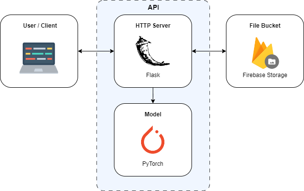

# Stylit API
[](https://pypi.org/project/Flask/) [](https://pytorch.org/) [](https://firebase.google.com/)


This is a Flask API that generates stylized images based on prompts using a pre-trained model. The generated images are uploaded to Firebase Storage and the corresponding public URLs are returned as responses.

<h1 align="center">
  </a>
</h1>

## Getting Started
These instructions will guide you on how to set up the API and run it locally.

### Prerequisites
- Python 3.7 or higher
- pip package manager

### Installation
1. Navigate to the project directory:
    ```bash
    cd api
    ```

2. Install the required dependencies:
    ```bash
    pip install -r requirements.txt
    ```

### Configuration
1. Obtain the Firebase service account key file (service-account.json) and place it in the project root directory.

2. Update the Firebase storage bucket name in the `server.py` file:
    ```python
    firebase_admin.initialize_app(cred, {'storageBucket':'your-storage-bucket-name'})
    ```

### Usage
1. Start the Flask development server:
    ```bash
    python server.py
    ```

2. The API will be accessible at http://localhost:5000/v1/ endpoint.

3. Send a POST request to http://localhost:5000/v1/images with the following JSON payload:
    ```json
    {
        "prompt": "your-prompt-text"
    }
    ```

4. The API will generate a stylized image based on the provided prompt and upload it to Firebase Storage.

5. The response will include the URL of the generated image.

## License
This project is licensed under the MIT License.